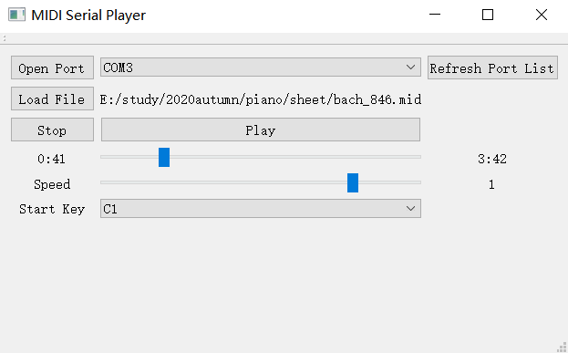

# MIDI-LED-controller

- A solution for controlling light bar with midi files on PC
- Using [Midifile library](https://github.com/craigsapp/midifile)

## Features

- program with GUI running on PC sends messages to Arduino board
-  Arduino receives messages and lights up corresponding LEDs
- adjustable speed
- playback bar
- 

## Requirement

- hardware
  - Arduino board
  - led light bar WS2812B, 144 light per meter
  - 5V power supply (optional)
- software
  - Arduino IDE
  - [FastLED library](http://fastled.io/)

## Usage

- download [release](https://github.com/LiGhauNgyan/MIDI-LED-controller/releases/) for windows or build from source code with Qt
- set parameters in `led-controller.ino`, see comments for details
- select the key corresponding to the leftmost light
- open serial port and load midi file
